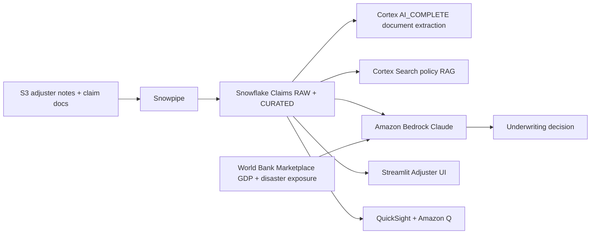

# APJ Insurance Claims & Underwriting

End-to-end insurance claims processing pipeline across **8 Asia-Pacific markets** using Snowflake and AWS — from raw document to AI-powered decision in seconds.

## Architecture

An APJ insurance claims and underwriting pipeline built on **Snowflake** (Snowpipe, Dynamic Tables, Cortex AI_COMPLETE, Cortex Search) and **AWS** (S3, Bedrock Claude, QuickSight + Amazon Q). Adjuster notes auto-ingest from S3; Cortex extracts structured fields; Bedrock joins with World Bank market data for the underwriting decision.



## Snowflake Capabilities

| Capability | Implementation |
|-----------|---------------|
| Dynamic Tables | RAW_CLAIMS -> CURATED.CLAIMS enrichment pipeline |
| Cortex AI | AI_COMPLETE for document extraction and claim evaluation |
| Cortex Search | 100 policy documents indexed for RAG |
| Cortex Agent | ClaimsAnalyst + PolicySearch tools |
| Semantic View | Structured analytics over claims, policies, market risk |
| Streamlit | 4-tab adjuster UI with claim evaluation |
| Marketplace | World Bank GDP + disaster exposure (zero ETL) |

## AWS Services

| Service | Role in Demo |
|---------|-------------|
| Amazon S3 | Adjuster notes and claim document ingestion |
| Amazon Bedrock | Claude-powered underwriting decision with market context |
| Amazon QuickSight | Executive claims and underwriting dashboard |
| Amazon Q | Natural language analytics for CFO |

## Personas

| Persona | Role | Key Questions |
|---------|------|---------------|
| **Claims Adjuster** | Evaluates claims, searches policies | "Evaluate this typhoon claim." "What does the travel policy cover?" |
| **Executive / CFO** | Strategic claims oversight | "What's our approval rate by country?" "Which claim types cost the most?" |

## Data

| Table | Rows | Description |
|-------|------|-------------|
| CUSTOMERS | 50 | APJ customers across 8 markets (country-appropriate names) |
| POLICIES | 100 | Auto, Home, Life, Health, Travel, Commercial |
| CLAIMS | 200 | Typhoons, monsoons, earthquakes, city traffic incidents |
| ADJUSTER_NOTES | 10 | Free-text adjuster field notes uploaded to S3 |
| COUNTRY_RISK | 8 | World Bank GDP, insurance penetration, disaster exposure |

## Build Instructions

### Prerequisites
- Snowflake account with ACCOUNTADMIN access
- Cortex AI enabled (AI_COMPLETE, Search, Agent)
- Warehouse: CORTEX (Medium)
- Snowflake Marketplace: World Bank data installed
- AWS CLI with Bedrock, QuickSight access (us-west-2)

### Deployment

The full build is documented in [`demo/DEMO_PLAN_V5.md`](demo/DEMO_PLAN_V5.md) (~100 min, 5 phases).

```bash
bash scripts/adjuster_notes.sh
snow streamlit deploy --replace -c <your-snowflake-connection>
bash quicksight/deploy.sh
```

### Streamlit App
```
INSURANCE_DEMO_DB.APP.INSURANCE_CLAIMS_APP
```

## Build Modes

### Snowflake Only
Follow the build plan in `demo/DEMO_PLAN_V5.md` but skip AWS phases. Deploy the Streamlit app from `streamlit/deploy/`. Uses Cortex AI instead of Bedrock, and Snowflake Intelligence instead of QuickSight.

### Full AWS + Snowflake
Follow all 5 phases in the build plan, deploy the main Streamlit app from `streamlit/`, then run `bash quicksight/deploy.sh`.

## Key Demo Numbers

- **200 claims** across 8 Asia-Pacific markets
- **100 policy documents** indexed for Cortex Search RAG
- **AI evaluation** combines Cortex extraction + Bedrock underwriting decision
- **World Bank enrichment** — GDP, disaster exposure, insurance penetration per market

## License

Apache 2.0 — See [LICENSE](LICENSE) for details.
