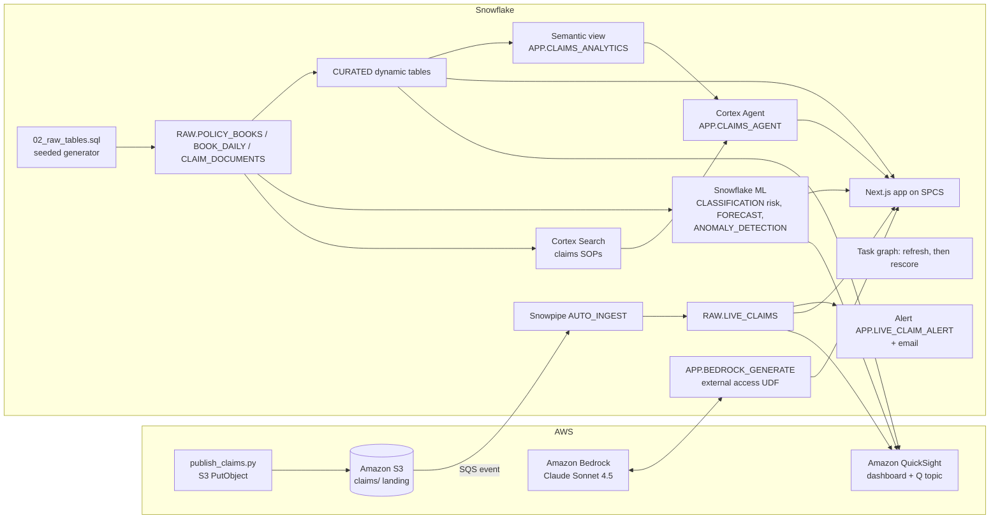

# APJ Insurance Claims and Fraud Analytics

End-to-end claims and fraud analytics for **40 policy books at a fictional insurer across 8 APJ markets** (Singapore, Hong Kong, Australia, Japan, South Korea, Malaysia, Thailand, Indonesia) and 5 lines of business, using Snowflake, optionally with AWS: from a live first-notice-of-loss (FNOL) claim to a 7-day fraudulent-claim risk score, an SIU referral email and an AI action memo for the head of claims.

## Architecture

A claims pipeline built on **Snowflake** (Dynamic Tables, Snowflake ML, Cortex Search, Cortex Agent, Cortex AI_COMPLETE, SPCS) and, in the full build, **AWS** (Amazon S3, Bedrock Claude, QuickSight + Amazon Q). FNOL claim events land in `RAW.LIVE_CLAIMS`. Dynamic tables curate 90 days of book-day history: claims filed and paid, earned premium and loss ratio, special investigations unit (SIU) referrals, confirmed fraud, denied claims and claims-file audit compliance. Snowflake ML scores 7-day fraudulent-claim risk per policy book, forecasts portfolio-wide claim volume and flags document mismatch anomalies. A Cortex Agent answers questions with SOP citations, and an LLM drafts the claims action memo.

Interactive diagrams (hover for object names): [Snowflake only](docs/architecture-snowflake.html) | [AWS + Snowflake](docs/architecture-aws.html). The app shows both on its Architecture & Data tab, the current build first. Regenerate them with `python3 docs/build_architecture.py`.


```mermaid
flowchart LR
    subgraph AWS
      UP[publish_claims.py<br/>S3 PutObject] --> S3[(Amazon S3<br/>claims/ landing)]
      BR[Amazon Bedrock<br/>Claude Sonnet 4.5]
      QS[Amazon QuickSight<br/>dashboard + Q topic]
    end
    subgraph Snowflake
      S3 -->|SQS event| PIPE[Snowpipe AUTO_INGEST] --> LIVE[RAW.LIVE_CLAIMS]
      GEN[02_raw_tables.sql<br/>seeded generator] --> RAW[RAW.POLICY_BOOKS / BOOK_DAILY / CLAIM_DOCUMENTS]
      RAW --> DT[CURATED dynamic tables]
      RAW --> ML[Snowflake ML<br/>CLASSIFICATION risk, FORECAST,<br/>ANOMALY_DETECTION]
      DT --> SV[Semantic view<br/>APP.CLAIMS_ANALYTICS]
      RAW --> CS[Cortex Search<br/>claims SOPs]
      SV --> AG[Cortex Agent<br/>APP.CLAIMS_AGENT]
      CS --> AG
      LIVE --> AL[Alert APP.LIVE_CLAIM_ALERT<br/>+ email]
      UDF[APP.BEDROCK_GENERATE<br/>external access UDF]
      TK[Task graph: refresh, then rescore]
      APP[Next.js app on SPCS]
    end
    BR <--> UDF
    DT --> APP
    ML --> APP
    LIVE --> APP
    AG --> APP
    UDF --> APP
    DT --> QS
    ML --> QS
    LIVE --> QS
```

The Snowflake-only build drops the AWS subgraph: `APP.SIMULATE_CLAIMS` writes to `RAW.LIVE_CLAIMS`, and the app calls Cortex `AI_COMPLETE` instead of the Bedrock UDF.

## Snowflake Capabilities

| Capability | Implementation |
|-----------|---------------|
| Dynamic Tables | `CURATED.KPI_SUMMARY`, `PERFORMANCE_SUMMARY`, `INDICATOR_SUMMARY`, `TREND_ANALYSIS` from the RAW tables |
| Snowflake ML | CLASSIFICATION 7-day fraudulent-claim risk (`ML.FRAUD_RISK_SCORES`), 14-day claims FORECAST, document mismatch ANOMALY_DETECTION |
| Cortex Search | 13 synthetic claims-investigation SOPs (one per line of business and fraud indicator) in `SEARCH.CLAIMS_SOP_SEARCH` |
| Semantic View | `APP.CLAIMS_ANALYTICS` over policy books, fraud indicators, daily totals and risk |
| Cortex Agent | `APP.CLAIMS_AGENT`: Cortex Analyst over the semantic view plus Cortex Search for SOP citations |
| Cortex AI | `AI_COMPLETE('claude-sonnet-4-5')` for grounded answers, and for the action memo in the Snowflake-only build |
| Alerts + Tasks | `APP.LIVE_CLAIM_ALERT` logs REFER events and sends email; task graph `TASK_REFRESH_CURATED`, then `TASK_RESCORE_RISK` |
| Snowpark Container Services | Next.js app `APP.APJ_INS_APP` with 6 tabs: Executive Cockpit, Predictive, Claims Audit, Live Claims, Ask AI, Architecture & Data |
| Snowpipe | `RAW.LIVE_CLAIMS_PIPE` AUTO_INGEST from S3 (AWS build only) |

## AWS Services

Used only in the AWS + Snowflake build.

| Service | Role in Demo |
|---------|-------------|
| Amazon S3 | Landing bucket (`claims/`): `aws/publish_claims.py` uploads FNOL claim batches as newline-delimited JSON. An event notification goes to the Snowpipe SQS queue |
| Amazon Bedrock | Claude Sonnet 4.5 writes the action memo, called from Snowflake through an external-access UDF |
| Amazon QuickSight | DIRECT_QUERY executive dashboard over Snowflake (daily claims and referrals, confirmed fraud by policy book, fraudulent-claim risk) |
| Amazon Q | Natural-language questions over the QuickSight topic `apj-ins-topic` |
| AWS IAM | Least-privilege role for Snowflake S3 reads and a Bedrock-only invoke user |

## Personas

These personas are fictional.

| Persona | Role | Key Questions |
|---------|------|---------------|
| **Mei Ling Tan** | Head of Claims | "What is our loss ratio by line of business?" "Which fraud indicators produce the most confirmed fraud?" |
| **Arjun Rao** | SIU Investigator | "Which policy books are high risk this week, and which SOP applies?" |

## Data

All data is synthetic and seeded, so every rebuild reproduces it. The insurer, policy books and names are fictional.

| Table | Rows | Description |
|-------|------|-------------|
| RAW.POLICY_BOOKS | 40 | Policy books: every combination of 8 markets and 5 lines of business (Motor, Home, Health, Travel, Commercial Property), with risk tier, policy tenure and earned premium |
| RAW.BOOK_DAILY | 3,600 | Daily book observations over 90 days: claims filed and paid (USD), earned premium, SIU referrals, confirmed fraud, denied claims, fraud indicator, claims-file audits, document mismatch and early-claim rates. Includes a typhoon (Hong Kong) and a flood (Thailand) catastrophe day |
| RAW.CLAIM_DOCUMENTS | 40 | Required, on-file and pending supporting documents per book |
| SEARCH.CLAIMS_SOP_DOCS | 13 | Synthetic claims-investigation SOPs indexed for Cortex Search |
| RAW.LIVE_CLAIMS | Grows during the demo | Live FNOL claim events from S3 (AWS build) or `APP.SIMULATE_CLAIMS` (Snowflake-only build) |
| ML.FRAUD_RISK_SCORES | 40 | 7-day fraudulent-claim probability and risk band per policy book |

## Build Instructions

### Prerequisites
- Snowflake account with ACCOUNTADMIN access, and Cortex AI enabled (AI_COMPLETE, Search, Agent).
- An X-Small warehouse with auto-suspend at or below 120 s, and an existing SPCS compute pool.
- Python 3.11+, `snowflake-connector-python`, Node.js 22+, Docker and the `snow` CLI.
- App image: run `snow spcs image-registry login`, then build and push `apj-ins-app:v1` to the database's `APP.IMAGES` repository (see the header of `snowflake/07_deploy_app.sql`).
- AWS build only: `boto3`, AWS credentials for the target account (us-west-2) with Bedrock access, and QuickSight Enterprise.

### SPCS App
```
<DATABASE>.APP.APJ_INS_APP
```

### Tests
```bash
python -m pytest aws snowflake quicksight
```

For a local run, put `SNOWFLAKE_ACCOUNT`, `SNOWFLAKE_USER`, `SNOWFLAKE_DATABASE`, `SNOWFLAKE_WAREHOUSE`, `SNOWFLAKE_AUTHENTICATOR=PROGRAMMATIC_ACCESS_TOKEN`, `SNOWFLAKE_TOKEN` and `DEMO_PLATFORM` in the environment, then run `npm --prefix app run build && npm --prefix app start`.

## Build Modes

Both modes share the same core. They differ in three places, and the app's `DEMO_PLATFORM` setting (in its SPCS spec) switches the memo provider and the Live Claims tab.

| Layer | Snowflake Only | Full AWS + Snowflake |
|---|---|---|
| Live claims | `CALL APP.SIMULATE_CLAIMS(n)` inserts simulated FNOL claim events into `RAW.LIVE_CLAIMS`. This simulates a claims intake feed; it is not Snowpipe Streaming | `aws/publish_claims.py` uploads claim batches to S3, then SQS and Snowpipe AUTO_INGEST |
| Action memo | Cortex `AI_COMPLETE('claude-sonnet-4-5')` | Amazon Bedrock Claude Sonnet 4.5 through `APP.BEDROCK_GENERATE` |
| BI and natural-language questions | The SPCS app is the dashboard; questions go to the Cortex Agent | Also a QuickSight dashboard and an Amazon Q topic |
| App setting | `DEMO_PLATFORM: snowflake` | `DEMO_PLATFORM: aws` |

### Snowflake Only

```bash
# 1. Core data and dynamic tables (guarded: new isolated database only)
python snowflake/run_core.py --database APJ_INSURANCE_SNOWFLAKE --warehouse <XS_WAREHOUSE> --connection <CONNECTION> --apply
# 2. Native claims feed, ML, search, semantic view, agent, alert and task graph
python snowflake/run_intelligence.py --database APJ_INSURANCE_SNOWFLAKE --platform snowflake --warehouse <XS_WAREHOUSE> --connection <CONNECTION> --alert-email you@example.com
# 3. App on SPCS with DEMO_PLATFORM=snowflake (push the image first)
python snowflake/run_intelligence.py --database APJ_INSURANCE_SNOWFLAKE --platform snowflake --warehouse <XS_WAREHOUSE> --connection <CONNECTION> --alert-email you@example.com --files 07_deploy_app.sql --compute-pool <COMPUTE_POOL>
```

During the demo:
- Run `CALL APP.SIMULATE_CLAIMS(20)` to add live claim events. For a continuous feed, run `ALTER TASK APP.TASK_SIMULATE_CLAIMS RESUME`, and `SUSPEND` it afterwards.
- Run `EXECUTE ALERT APP.LIVE_CLAIM_ALERT` to raise the SIU referral email.
- Run `EXECUTE TASK APP.TASK_REFRESH_CURATED` to refresh the curated tables and rescore risk.

Afterwards, drop the database or run `ALTER SERVICE APP.APJ_INS_APP SUSPEND`.

### Full AWS + Snowflake

```bash
# 1. Core data and dynamic tables (guarded: new isolated database only)
python snowflake/run_core.py --database APJ_INSURANCE_AWS --warehouse <XS_WAREHOUSE> --connection <CONNECTION> --apply
# 2. AWS ingestion and Bedrock (dry run first, then --apply)
python aws/setup_aws.py --database APJ_INSURANCE_AWS --account <AWS_ACCOUNT_ID> --connection <CONNECTION> --apply
# 3. ML, search, semantic view, agent, alert and task graph
python snowflake/run_intelligence.py --database APJ_INSURANCE_AWS --platform aws --warehouse <XS_WAREHOUSE> --connection <CONNECTION> --alert-email you@example.com
# 4. App on SPCS with DEMO_PLATFORM=aws (push the image first)
python snowflake/run_intelligence.py --database APJ_INSURANCE_AWS --platform aws --warehouse <XS_WAREHOUSE> --connection <CONNECTION> --alert-email you@example.com --files 07_deploy_app.sql --compute-pool <COMPUTE_POOL>
# 5. QuickSight dashboard and Q topic (needs an existing Snowflake data source)
python quicksight/build_dashboards.py --database APJ_INSURANCE_AWS --account <AWS_ACCOUNT_ID> --principal-arn <QUICKSIGHT_USER_ARN> --data-source-arn <DATA_SOURCE_ARN> --prefix apj-ins --apply --update --with-topic
```

QuickSight objects must be shared with the QuickSight user who signs in (`--principal-arn`); otherwise the console shows nothing.

During the demo:
- Run `python aws/publish_claims.py --account <AWS_ACCOUNT_ID> --count 20` to upload a batch of live claim events. Snowpipe loads it within about a minute.
- Run `EXECUTE ALERT APP.LIVE_CLAIM_ALERT` to raise the SIU referral email.
- Run `EXECUTE TASK APP.TASK_REFRESH_CURATED` to refresh the curated tables and rescore risk.

Afterwards, `python aws/teardown_aws.py --database APJ_INSURANCE_AWS --account <AWS_ACCOUNT_ID> --connection <CONNECTION> --apply` removes the AWS resources and the account-level Bedrock external-access and S3 storage integrations. It leaves the email integration `APJ_INS_EMAIL_INT`, which the Snowflake-only build also uses.

## Business Impact

Industry research and Snowflake customer outcomes:
- **Insurance fraud** steals at least $308.6 billion every year from American consumers, and occurs in about 10% of property-casualty insurance losses -- [Coalition Against Insurance Fraud, Fraud Stats](https://insurancefraud.org/fraud-stats/)
- **Claims experience**: $170 billion in premium is at risk over the next 5 years as customers switch carriers due to not being fully satisfied by the claims process -- [Accenture, Transforming claims and underwriting with AI](https://www.accenture.com/us-en/insights/insurance/ai-transforming-claims-underwriting)
- **Emirates Insurance** (Snowflake customer) registers motor claims 30-40% faster with AI, and automated reconciliation processes to save 380 hours of work over three months -- [Snowflake customer story: Emirates Insurance](https://www.snowflake.com/en/customers/all-customers/case-study/Emirates/)

## Key Demo Numbers

These figures are synthetic and come from the seeded demo data. Forecast and anomaly figures can shift slightly with the build day.

- **40 policy books** (8 markets x 5 lines), 3,600 book-days over 90 days: **76,317 claims** filed, USD 301 M paid against USD 412.9 M earned premium, so the **loss ratio is 72.9%**. By line, Travel runs highest (76.5%) and Health lowest (69.5%); the worst book is BK-0034 Australia Commercial Property at 101.9%
- **602 SIU referrals** and **151 confirmed fraudulent claims**, so referral precision is 25.1%; **70** fraudulent claims denied
- **Pre-existing damage** produces the most confirmed fraud (33 of 89 referrals); the 10 catastrophe claim surge referrals (typhoon and flood days) are never confirmed
- **Fraud risk model** out-of-time holdout: precision 0.34, recall 0.24 at a 0.5 threshold, against a 0.21 base rate. Five books are high risk; the top book is BK-0012 South Korea Home, at 74.4%
- **14-day claims forecast** with prediction intervals; **31 of 640** book-days flagged as document mismatch anomalies
- **Claims-file audit compliance 80.3%**, supporting-document coverage 54.4%, with 21 documents pending
- **13 SOPs** indexed for Cortex Search and cited by ID in agent answers

## License

Apache 2.0 — See [LICENSE](LICENSE) for details.

This is a personal demo project and is not an official Snowflake offering. It comes with no support or warranty. Industry metrics cited are from publicly available third-party research and Snowflake customer stories; they represent reported outcomes and are not guarantees of results.
